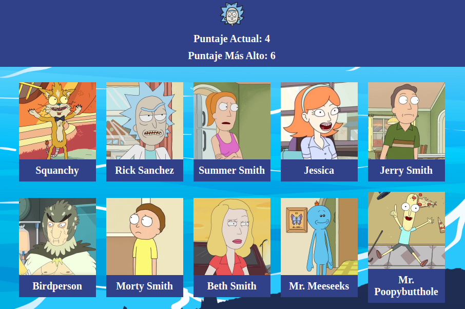

# Juego de Memoria

Juego de Memoria usando React.
El juego consiste en 10 cartas de personajes. El usuario debe cliquear todas las imágenes exactamente una vez.
Cuando el usuario cliquea una imagen, las cartas son redistribuidas aleatoriamente. Si el usuario cliquea la misma imagen dos veces el puntaje se reinicia a 0.

